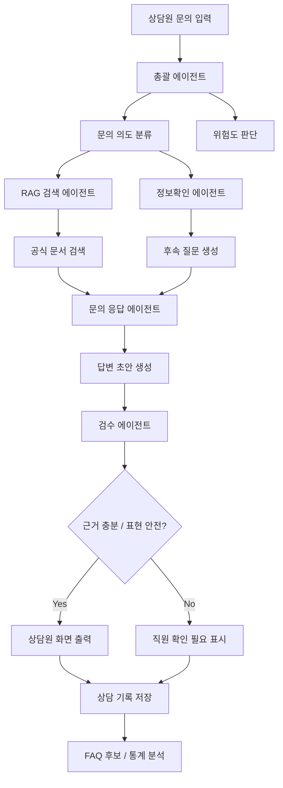

# 동국대학교 입학처 상담 보조 에이전트

동국대학교 입학처의 전화/방문/온라인 문의 응대를 돕기 위한 내부용 웹 기반 상담 보조 도구입니다.

이 시스템의 목표는 AI가 상담원을 대체하는 것이 아니라, 상담원이 공식 문서를 근거로 정확하고 보수적으로 답변할 수 있도록 돕는 것입니다. 답변 초안, 후속 질문, 근거 문서, PDF 페이지 링크, 원문 발췌, 위험도 판단, 상담 기록 저장을 함께 제공해 잘못된 안내 가능성을 줄입니다.

## 핵심 원칙

- 공식 자료 기반으로만 답변합니다.
- 근거가 부족한 내용은 단정하지 않습니다.
- 답변에는 근거 문서명, 페이지, 섹션, 원문 링크를 함께 표시합니다.
- 전형명, 학년도, 모집시기, 제출서류, 일정, 지원자격은 보수적으로 안내합니다.
- 고위험 문의는 상담원이 최종 확인하거나 담당자 확인으로 넘깁니다.
- 외부 민원인에게 직접 공개하기 전에 내부 상담원 보조 도구로 먼저 운영합니다.

## 주요 사용자

- 입학처 상담원
- 입학처 근로학생
- 입학처 담당 직원
- 입학 상담 데이터를 분석하는 관리자

## MVP 범위

1. 상담원이 문의 내용을 입력합니다.
2. 총괄 에이전트가 문의 의도와 위험도를 분류합니다.
3. 정보확인 에이전트가 답변 전 필요한 후속 질문을 생성합니다.
4. RAG 검색 에이전트가 입학처 공식 문서에서 근거를 검색합니다.
5. 문의 응답 에이전트가 상담원용 답변 초안을 작성합니다.
6. 검수 에이전트가 근거 부족, 단정 표현, 최신성 문제를 점검합니다.
7. 상담원이 답변을 확인/수정한 뒤 상담 기록을 저장합니다.

## 현재 개발 상태

현재 저장소에는 상담원 화면 MVP가 포함되어 있습니다.

- `index.html`: 상담원용 웹 화면
- `styles.css`: 화면 스타일
- `app.js`: 문의 분류, 후속 질문, 답변 초안, 근거 문서 표시 프로토타입
- `server.mjs`: 의존성 없는 로컬 정적 서버
- `data/raw_pdfs/`: 입학처 원본 PDF 업로드 위치
- `data/processed/`: 추출/청킹/임베딩 결과 저장 예정 위치
- `public/sources/`: 웹 화면에서 바로 열 PDF 파일 위치

### PDF 업로드 위치

입학처 관련 원본 PDF는 우선 아래 폴더에 넣습니다.

```text
data/raw_pdfs/
```

상담원 화면에서 `PDF 열기` 또는 `해당 페이지 열기` 버튼으로 바로 확인할 PDF는 아래 폴더에 넣습니다.

```text
public/sources/
```

예를 들어 `2026_susi_guide.pdf` 파일을 `public/sources/`에 넣으면 화면에서 다음 링크 형식으로 해당 페이지를 열 수 있습니다.

```text
public/sources/2026_susi_guide.pdf#page=52
```

### 로컬 실행

Node.js가 PATH에 없더라도 Codex 번들 Node로 실행할 수 있습니다.

```powershell
C:\Users\USER\.cache\codex-runtimes\codex-primary-runtime\dependencies\node\bin\node.exe server.mjs
```

실행 후 브라우저에서 아래 주소를 엽니다.

```text
http://localhost:4173
```

### OpenAI 기반 답변/검수 에이전트 사용

기본 실행은 로컬 규칙 기반 파이프라인으로 동작합니다. 더 자연스럽고 상담원용에 가까운 답변 초안과 검수 결과를 사용하려면 서버 실행 전에 OpenAI API 키를 환경변수로 설정합니다.

```powershell
$env:OPENAI_API_KEY="sk-..."
$env:OPENAI_MODEL="gpt-4.1-mini"
C:\Users\USER\.cache\codex-runtimes\codex-primary-runtime\dependencies\node\bin\node.exe server.mjs
```

동작 방식:

- `/api/analyze`가 먼저 PDF/웹 인덱스에서 근거를 검색합니다.
- 검색된 근거만 LLM에 전달합니다.
- LLM은 상담원용 답변 초안, 후속 질문, 주의사항, 검수 결과를 JSON으로 반환합니다.
- API 키가 없거나 호출에 실패하면 기존 규칙 기반 답변으로 자동 전환됩니다.
- 고위험 문의는 LLM 답변이 있어도 담당자 확인 필요로 표시합니다.

### PDF 인덱스 생성

`data/raw_pdfs/`에 PDF를 넣은 뒤 아래 명령으로 페이지별 텍스트 인덱스를 생성합니다.

```powershell
C:\Users\USER\.cache\codex-runtimes\codex-primary-runtime\dependencies\python\python.exe scripts/index_pdfs.py
```

생성 결과:

```text
data/processed/pdf_index.json
```

현재 MVP는 이 JSON을 사용해 `/api/search`에서 간단한 키워드 기반 근거 검색을 수행합니다. 이후 OpenAI embeddings, pgvector, Qdrant 등으로 교체하면 본격적인 의미 기반 RAG로 확장할 수 있습니다.

### 입학처 웹사이트 인덱스 생성

입학처 홈페이지의 공지사항, 자료실, 입시결과, FAQ, 고교동국연계 프로그램 안내도 로컬 검색 인덱스로 수집할 수 있습니다.

대상 사이트:

```text
https://ipsi.dongguk.edu/admission/html/main/main.asp
```

수집 스크립트:

```powershell
C:\Users\USER\.cache\codex-runtimes\codex-primary-runtime\dependencies\python\python.exe scripts/crawl_dongguk.py --max-items 5 --delay 0.4
```

생성 결과:

```text
data/processed/web_index.json
```

수집 대상:

- 입학도우미 공지사항, 자료실, FAQ, 입시결과
- 수시/정시/재외국민/편입학 공지사항
- 수시/정시/재외국민/편입학 자료실
- 고교동국연계 공지사항
- 고교동국연계 프로그램 운영일정
- 고교동국연계 프로그램
- 교사간담회

운영 원칙:

- 공식 입학처 도메인만 수집합니다.
- 게시판은 최신 글 위주로 낮은 빈도로 수집합니다.
- 본문 텍스트, 게시일, 모집시기, 첨부파일명, 원문 URL을 함께 저장합니다.
- 답변에는 웹 원문 링크를 근거로 표시합니다.
- 크롤링 결과는 최신 공지 확인 보조용이며, 고위험 문의는 담당자 확인 후 안내합니다.

`server.mjs`는 `pdf_index.json`과 `web_index.json`이 모두 있으면 두 인덱스를 함께 검색합니다. `web_index.json`이 아직 없어도 기존 PDF 검색은 그대로 동작합니다.

## 전체 구조



## 에이전트 구성

### 1. 총괄 에이전트

문의 전체 흐름을 조율합니다.

- 문의 의도 분류
- 관련 모집시기/전형 추정
- 답변 가능 여부 판단
- 위험도 판단
- 필요한 하위 에이전트 호출
- 고위험 문의의 담당자 확인 여부 결정

예시 분류:

- 지원자격
- 제출서류
- 전형일정
- 면접/논술/실기
- 충원합격
- 등록/환불
- 전년도 입시결과
- 복수지원
- 특수 케이스
- 민원/이의신청

### 2. 정보확인 에이전트

상담원이 민원인에게 추가로 물어봐야 할 질문을 생성합니다.

입시 문의는 질문 자체가 불완전한 경우가 많기 때문에, 바로 답변하기 전에 상황을 특정해야 합니다.

예시:

```text
문의:
검정고시생도 학생부종합 지원 가능한가요?

후속 질문:
1. 지원하시려는 학년도는 몇 학년도인가요?
2. 수시/정시/편입 중 어떤 모집을 말씀하시나요?
3. 학생부종합 중 구체적인 전형명이 무엇인가요?
4. 검정고시 합격 연도는 어떻게 되나요?
```

### 3. RAG 검색 에이전트

입학처 공식 문서를 검색해 답변 근거를 반환합니다.

검색 대상:

- 모집요강 PDF
- 전형별 세부 안내 PDF
- 입학처 공지사항
- 입학처 FAQ
- 제출서류 양식
- 학과별 모집인원
- 전년도 입시결과
- 면접/논술/실기 일정 공지
- 장학/등록/충원합격 안내
- 재외국민/외국인/편입학 등 별도 전형 자료

문서 검색 결과는 반드시 페이지와 출처 정보를 포함해야 합니다.

```json
{
  "content": "검정고시 출신자는 지원자 유형별 제출서류를 확인해야 합니다.",
  "source_title": "2026학년도 수시모집요강",
  "source_type": "모집요강",
  "admission_year": "2026",
  "recruitment_type": "수시",
  "admission_track": "학생부종합",
  "page": 52,
  "section": "지원자 유형별 제출서류",
  "published_date": "2025-05-31",
  "url": "https://ipsi.dongguk.edu/example/2026_susi_guide.pdf",
  "page_url": "https://ipsi.dongguk.edu/example/2026_susi_guide.pdf#page=52",
  "file_id": "2026_susi_guide.pdf",
  "chunk_id": "2026_susi_guide_p52_001"
}
```

### 4. 문의 응답 에이전트

검색된 근거와 후속 질문을 바탕으로 상담원용 답변 초안을 작성합니다.

응답 원칙:

- 검색 결과에 없는 내용은 답하지 않습니다.
- 근거 없는 추측을 하지 않습니다.
- 날짜, 전형명, 제출서류, 자격요건은 원문 표현을 우선합니다.
- 핵심 주장에는 근거 문서와 페이지를 연결합니다.
- 근거가 불충분하면 추가 질문이나 직원 확인을 안내합니다.

### 5. 검수 에이전트

답변 초안을 독립적으로 점검합니다.

검수 항목:

- 근거 문서가 답변 내용을 실제로 뒷받침하는가
- 학년도, 모집시기, 전형명, 일정, 서류명이 정확한가
- 사용자가 물어본 범위를 넘어 과하게 해석하지 않았는가
- 단정 표현이 적절한가
- 모집요강과 최신 공지사항이 충돌하지 않는가
- 합격 가능성, 복수지원 위반, 서류 미제출 등 고위험 문의인가

검수 결과 예시:

```json
{
  "verdict": "needs_review",
  "risk_level": "high",
  "issues": [
    "제출서류 마감일의 직접 근거가 검색 결과에 없습니다.",
    "지원 가능 여부를 단정하기 전에 세부 전형명 확인이 필요합니다."
  ],
  "required_human_review": true
}
```

### 6. 기록/분석 에이전트

상담 데이터를 구조화해 저장하고 추후 활용합니다.

- 반복 문의 자동 그룹화
- FAQ 후보 생성
- 자주 수정되는 AI 답변 탐지
- 근거 문서가 부족한 문의 유형 분석
- 전형별/시기별 문의 통계
- 공지사항 보완 필요 항목 추천

## 위험도 분류

### 낮은 위험

- 입학처 위치
- 전화번호
- 홈페이지 메뉴 안내
- 모집요강 다운로드 위치
- 단순 일정 안내

### 중간 위험

- 전형별 지원자격
- 제출서류
- 면접/논술/실기 일정
- 충원합격 발표
- 등록금 납부 일정

### 높은 위험

- 지원 가능 여부 확답
- 불합격 처리 여부
- 서류 미제출/오제출
- 복수지원 위반 가능성
- 외국고/검정고시/특수 케이스
- 합격 가능성 예측
- 전년도 입시결과 해석
- 이의신청/민원성 문의

고위험 문의는 AI가 단정 답변하지 않고, 근거 기반 안내와 담당자 확인 필요 표시를 함께 제공합니다.

## 상담원 화면 설계

초기 MVP의 핵심 화면입니다.

```text
[문의 입력]
검정고시생도 학생부종합 지원 가능한가요?

[AI 분석]
- 문의 유형: 지원자격
- 관련 모집: 2026학년도 수시
- 관련 전형: 학생부종합
- 위험도: 중간
- 상태: 세부 전형명 확인 필요

[상담원이 물어볼 후속 질문]
1. 지원하시려는 세부 전형명이 어떻게 되나요?
2. 지원 학년도는 2026학년도가 맞나요?
3. 검정고시 합격 연도는 어떻게 되나요?

[답변 초안]
검정고시 출신자의 학생부종합전형 지원 가능 여부는 세부 전형별 지원자격에 따라 달라질 수 있습니다.
먼저 지원하시려는 학년도, 모집시기, 세부 전형명을 확인한 뒤 모집요강의 지원자격과 제출서류 기준으로 안내드릴 수 있습니다.

[근거 문서]
1. 2026학년도 수시모집요강
   - p. 37, 학생부종합전형 지원자격
   - p. 52, 지원자 유형별 제출서류
   - PDF 해당 페이지 열기
   - 원문 보기

[상담원 주의사항]
- 세부 전형명을 확인하기 전에는 "지원 가능"이라고 단정하지 마세요.
- 검정고시 출신자의 제출서류는 전형별로 다를 수 있습니다.

[상담 기록]
- 그대로 사용
- 수정 후 사용
- 직원 확인 필요
- FAQ 후보 등록
```

## 근거 PDF 페이지 바로 열기

답변 근거는 상담원이 즉시 확인할 수 있어야 합니다.

PDF 원문 URL이 있는 경우 페이지 링크를 다음 형식으로 생성합니다.

```text
https://example.com/2026_susi_guide.pdf#page=52
```

상담원 화면에는 다음 버튼을 제공합니다.

- PDF 열기
- 해당 페이지 열기
- 원문 발췌 보기
- 근거 문장 복사
- 출처 링크 복사

구현 시 저장할 필드:

```json
{
  "source_title": "2026학년도 수시모집요강",
  "page": 52,
  "section": "지원자 유형별 제출서류",
  "url": "https://ipsi.dongguk.edu/example/2026_susi_guide.pdf",
  "page_url": "https://ipsi.dongguk.edu/example/2026_susi_guide.pdf#page=52",
  "quoted_text": "원문 발췌 내용",
  "retrieved_at": "2026-07-09T10:00:00+09:00"
}
```

중요한 점:

- 검색된 모든 문서를 보여주지 않고 실제 답변에 사용된 근거만 표시합니다.
- 페이지 정보가 없는 문서는 답변 근거로 쓰지 않거나 신뢰도를 낮게 표시합니다.
- 모집요강과 최신 공지사항이 충돌하면 충돌 가능성을 표시합니다.
- 최신 공지사항이 모집요강을 정정하는 경우 최신 공지사항을 우선하되, 상담원 확인을 요구합니다.

## 원문 표시 방식

상담원이 빠르게 확인할 수 있도록 답변 옆에 원문 발췌를 함께 표시합니다.

```text
[답변 문장]
검정고시 출신자의 제출서류는 지원자 유형별 제출서류 기준을 확인해야 합니다.

[근거]
2026학년도 수시모집요강 p.52, 지원자 유형별 제출서류

[원문 발췌]
"검정고시 출신자 ..."

[동작]
PDF 해당 페이지 열기 | 원문 복사 | 출처 복사
```

원문 발췌는 너무 길게 보여주지 않고, 상담원이 판단할 수 있는 최소 범위로 표시합니다.

## 상담 기록 데이터 구조

문의 데이터는 추후 FAQ, 통계, 문서 개선에 활용할 수 있도록 구조화해 저장합니다.

```json
{
  "question_raw": "검정고시생도 학종 가능해요?",
  "question_summary": "검정고시 출신자의 학생부종합전형 지원 가능 여부 문의",
  "admission_year": "2026",
  "recruitment_type": "수시",
  "admission_track": "학생부종합",
  "intent": "지원자격",
  "risk_level": "medium",
  "follow_up_questions": [
    "구체적인 전형명이 무엇인가요?",
    "지원 학년도는 2026학년도인가요?"
  ],
  "draft_answer": "검정고시 출신자의 지원 가능 여부는 세부 전형에 따라 다를 수 있습니다.",
  "final_answer": "상담원이 최종 사용한 답변",
  "sources": [
    {
      "title": "2026학년도 수시모집요강",
      "page": 52,
      "section": "지원자 유형별 제출서류",
      "url": "https://ipsi.dongguk.edu/example/2026_susi_guide.pdf",
      "page_url": "https://ipsi.dongguk.edu/example/2026_susi_guide.pdf#page=52"
    }
  ],
  "human_modified": true,
  "resolution_status": "answered",
  "faq_candidate": true,
  "created_at": "2026-07-09T10:00:00+09:00"
}
```

## 문서 데이터 구조

RAG 품질을 높이기 위해 PDF를 단순 텍스트 덩어리로 저장하지 않고 입시 도메인에 맞게 구조화합니다.

권장 청크 단위:

- 전형 단위
- 모집단위 단위
- 지원자격 단위
- 제출서류 단위
- 일정 단위
- 유의사항 단위
- FAQ 단위

문서 메타데이터:

```json
{
  "document_id": "2026_susi_guide",
  "document_type": "모집요강",
  "title": "2026학년도 수시모집요강",
  "admission_year": "2026",
  "recruitment_type": "수시",
  "admission_track": "학생부종합",
  "page_start": 37,
  "page_end": 38,
  "section": "지원자격",
  "published_date": "2025-05-31",
  "source_url": "https://ipsi.dongguk.edu/example/2026_susi_guide.pdf",
  "version": "1.0",
  "is_active": true
}
```

## 권장 기술 스택

초기 MVP 기준:

- Frontend: Next.js 또는 React
- Backend: FastAPI 또는 Node.js
- Database: PostgreSQL
- Vector Search: pgvector 또는 Qdrant
- File Storage: 로컬 파일 저장소, S3 호환 스토리지, 또는 학교 내부 저장소
- Auth: 학교 Google/Microsoft 계정 또는 내부 계정
- LLM: OpenAI API 또는 학교 보안 정책에 맞는 모델

MVP에서는 PostgreSQL + pgvector 조합을 우선 검토합니다. 상담 기록, 문서 메타데이터, 벡터 검색을 한 곳에서 관리하기 쉽습니다.

## 화면 구성

### 상담 화면

- 빠른 응대를 위해 기본 화면은 `문의 입력`과 `바로 볼 답변` 두 영역으로 제한합니다.
- 상담원이 직접 처리하기 어려운 문의만 입력하는 것을 전제로 합니다.
- 입력 보조 항목은 `학년도`, `모집구분`, `세부 전형/유형`으로 구성합니다.
- `모집구분`은 수시, 정시, 편입학, 재외국민/외국인 중 선택하고, `세부 전형/유형`은 모집구분에 따라 드롭다운 선택지가 바뀝니다.
- 편입학을 선택하면 `편입학 유형` 필드가 추가로 나타나며 일반편입학/학사편입학을 먼저 고릅니다.
- 편입학의 `세부 모집구분`에서는 농어촌학생, 특성화고교졸업자, 기초생활수급자및차상위계층, 특성화고등을졸업한재직자, 의료인력 양성 관련학과 전문학사학위 소지자 등을 선택합니다.
- 기본 화면에는 문의 의도, 위험도, 먼저 물어볼 질문, 답변 초안, 핵심 근거 1개만 표시합니다.
- 근거 문서 전체, PDF 해당 페이지 열기, 원문 발췌, 상담 기록 JSON은 접힌 상세 영역에서 확인합니다.
- `근거 문서 보기`를 펼치면 PDF 뷰어가 액자처럼 표시되고, 기본으로 핵심 근거의 해당 페이지가 열립니다.
- PDF 뷰어 상단의 `p.4`, `p.93` 같은 근거 페이지 버튼을 누르면 같은 화면의 PDF 액자가 해당 페이지로 다시 열립니다.
- iframe 안의 PDF 뷰어가 같은 파일의 `#page=` 변경을 무시하지 않도록 `viewerPage`/`viewerTs` 쿼리값을 붙여 강제로 해당 페이지를 다시 로드합니다.
- `해당 페이지로 이동` 버튼으로 새 탭에서 PDF 페이지를 열 수 있습니다.
- 목표 응답 흐름은 `문의 입력 -> 상담 보조안 생성 -> 후속 질문/답변/핵심 근거 확인`입니다.

### 문서 관리 화면

- PDF 업로드
- 공지사항 URL 등록
- 문서 버전 관리
- 학년도/모집시기/전형 태그 지정
- 문서 처리 상태 확인
- 검색 인덱스 재생성

### 상담 기록 화면

- 날짜별 문의 검색
- 전형별 문의 검색
- 위험도별 필터
- 상담원이 수정한 답변 확인
- 미해결 문의 확인
- FAQ 후보 등록

### FAQ 후보 화면

- 반복 문의 자동 그룹화
- FAQ 초안 생성
- 담당자 승인
- 홈페이지 반영 후보 관리

### 관리자 화면

- 사용자 권한 관리
- 답변 정책 관리
- 금지 표현 관리
- 위험도 기준 관리
- 모델 설정
- 문서 최신성 점검

## 답변 정책

금지하거나 제한해야 할 표현:

- "합격 가능성이 높습니다."
- "이 성적이면 됩니다."
- "아마 가능할 것 같습니다."
- "서류가 조금 늦어도 괜찮을 수 있습니다."
- "무조건 지원 가능합니다."
- "불합격 처리는 아닐 겁니다."

권장 표현:

```text
합격 가능성은 지원자 전체의 성적, 경쟁률, 평가 요소에 따라 달라져 단정적으로 안내하기 어렵습니다.
다만 전년도 입시결과는 참고자료로 확인하실 수 있습니다.
```

```text
지원 가능 여부는 모집시기와 세부 전형별 지원자격에 따라 달라질 수 있습니다.
지원하시려는 학년도, 모집시기, 전형명을 확인한 뒤 모집요강 기준으로 안내드리겠습니다.
```

```text
제출서류와 마감일은 불이익이 발생할 수 있는 중요한 사항이므로, 모집요강 및 최신 공지사항 기준으로 확인이 필요합니다.
```

## 개발 순서

1. 프로젝트 초기 세팅
2. 상담원 웹 화면 MVP 구현
3. 문서 업로드 및 PDF 텍스트 추출
4. 문서 메타데이터 저장
5. RAG 검색 구현
6. 후속 질문 생성 구현
7. 답변 초안 생성 구현
8. 근거 문서/페이지/원문 표시 구현
9. PDF 해당 페이지 바로 열기 구현
10. 검수 에이전트 구현
11. 상담 기록 저장 구현
12. FAQ 후보 생성 기능 구현

## 향후 확장

- 입학처 공지사항 자동 수집
- 최신 공지와 기존 모집요강 충돌 탐지
- 반복 문의 대시보드
- 상담원별 답변 수정 패턴 분석
- FAQ 자동 생성 및 승인 워크플로우
- 홈페이지 공개용 FAQ 챗봇
- 상담 품질 리포트
- 시즌별 문의량 예측

## 입학처 웹사이트 크롤링 원칙

입학처에서 운영하는 설명회, 전공체험, 고교연계, 학부모연수, 모의논술, 상담 프로그램 등은 PDF 모집요강에 모두 담기지 않는 경우가 많으므로 웹사이트 공지사항 크롤링이 필요합니다.

다만 전체 사이트를 무작정 긁기보다 공식 입학처 도메인과 필요한 게시판만 허용 목록으로 관리합니다.

권장 수집 대상:

- 입학처 공지사항
- 수시/정시/편입/재외국민 공지
- 고교연계 프로그램 안내
- 입시설명회/박람회/상담 프로그램 안내
- 학부모연수/교사연수 안내
- 전형별 추가 안내 및 정정 공지
- 첨부 PDF, HWP, DOCX 파일

크롤링 데이터에도 문서와 동일하게 출처를 저장합니다.

```json
{
  "source_type": "입학처 공지사항",
  "title": "2027학년도 수시모집 안내 프로그램 공지",
  "url": "https://ipsi.dongguk.edu/...",
  "published_date": "2026-07-01",
  "collected_at": "2026-07-09T10:00:00+09:00",
  "content": "공지 본문",
  "attachments": [
    {
      "file_name": "안내문.pdf",
      "url": "https://ipsi.dongguk.edu/.../file.pdf"
    }
  ],
  "is_active": true
}
```

운영 원칙:

- 공식 입학처 웹사이트만 수집합니다.
- 수집 시점과 게시일을 반드시 저장합니다.
- 기존 공지와 수정 공지가 충돌하면 최신 공지를 우선 표시하되 담당자 확인을 요구합니다.
- 삭제되거나 비공개된 공지는 바로 폐기하지 않고 비활성 상태로 보관해 상담 이력을 추적합니다.
- 외부 블로그, 커뮤니티, 비공식 자료는 답변 근거로 사용하지 않습니다.

## 한 줄 정의

이 시스템은 입학처 공식 문서를 기반으로 상담원이 정확하고 보수적으로 답변하도록 돕고, 답변 전 필요한 확인 질문을 제안하며, 근거 문서와 PDF 페이지를 함께 제공하고, 상담 데이터를 구조화해 향후 FAQ와 입학처 운영 개선에 활용하는 내부용 웹 상담 보조 에이전트입니다.
